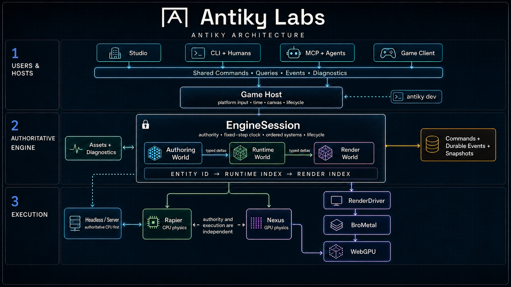

<p align="center">
  <picture>
    <source media="(prefers-color-scheme: dark)" srcset="packages/website/public/brand/antiky-labs-wordmark-and-text-white.png">
    <source media="(prefers-color-scheme: light)" srcset="packages/website/public/brand/antiky-labs-wordmark-and-text-black.png">
    
  </picture>

  <br>
  <strong>Tools for making worlds.</strong>
  <br><br>

  [Website](https://antikylabs.com) &nbsp;·&nbsp; [Developer docs](docs/user-facing-docs/README.md) &nbsp;·&nbsp; [Vision](docs/VISION_DIRECTION_H.md) &nbsp;·&nbsp; [Discord](https://discord.gg/3Qs2uejUf9)
</p>

# Antiky

Antiky is an emerging game framework and local development runtime from Antiky Labs. It is built
for 2D, 3D, and especially **2.3D** games: crisp 2D characters and objects inside spatial,
depth-aware 3D worlds.

The framework runs game rules and exposes structured engine state. The CLI starts and supervises a
complete local development session. Coding agents connect through Model Context Protocol (MCP), and
the future Antiky Studio will use the same commands, queries, diagnostics, and measurements.

Antiky renders through [BroMetal](https://brometal.dev), a typed shader and WebGPU runtime. A game
does not need Studio, MCP, or a renderer to use the headless framework.

> [!IMPORTANT]
> Antiky is in active, pre-release development. The Framework and CLI are not published as stable
> packages, and their APIs can change. Studio is planned but is not yet an application you can
> install. The browser demos and the source development workflow in this repository work today.

## Why Antiky exists

Antiky Labs is building the framework and tools needed to make Emberwyrd, an online fantasy action
RPG. We grow the framework through complete game features instead of designing a general engine in
the abstract.

That approach gives Antiky a few deliberate properties:

- **One engine API.** People, agents, the CLI, Studio, and tests use the same underlying services.
- **Structured development state.** Agents read stable IDs, revisions, diagnostics, measurements,
  and command results instead of guessing from screenshots or terminal text.
- **Framework without editor lock-in.** Games build and run without Studio. Studio is a visual
  client, not the owner of game state.
- **Explicit authority.** Validated commands change authoritative state. Inspection stays read-only,
  and corrections record what happened instead of deleting history.
- **Rendering below game rules.** BroMetal owns typed GPU work. Antiky owns worlds, simulation,
  authoring, inspection, and the mapping into rendering.
- **Incremental scope.** Real demos prove each reusable boundary before Antiky adds another layer or
  package.

AI-native has a specific meaning here: a coding agent can inspect and operate a live game through
versioned, permission-aware tools. AI does not become the authority for game state, and Antiky does
not require one model provider.

## What works today

- `antiky dev` starts the configured game process, shader watcher, inspection service, and MCP
  server as one development session.
- `antiky inspect` reads the current build, process, runtime, render, and diagnostic state as
  structured JSON.
- `antiky tool` calls the same MCP tools that coding agents use, including game reload, frame
  capture, runtime inspection, and point-light authoring.
- `@antiky/framework` supplies the fixed-step `EngineSession`, stable UUIDv7 identities, immutable
  runtime inspection snapshots, and the first framework-owned point-light command and correction
  flow.
- Antiky Town uses that framework path while the original BroMetal town remains available as its
  visual and behavioral reference.
- Browser studies exercise the current 2.3D, shader, sprite, voxel, and WebGPU work.

## How the pieces fit

[](docs/architecture/README.md)

The CLI owns local configuration, child processes, builds, connections, and cleanup. The framework
owns semantic game facts and engine rules. MCP adapts those shared services today. The future
Studio will use the same boundary instead of implementing a second engine control path.

## Quick start from source

You need Node.js 22 or newer, npm, and a WebGPU-capable browser for the rendered demos.

```bash
git clone https://github.com/antikylabs/site.git
cd site
npm install
npm run antiky -- dev
```

The repository's [`antiky.config.json`](antiky.config.json) starts the focused Antiky Town game
host, shader watcher, inspection service, and Streamable HTTP MCP endpoint. The CLI prints the game,
inspection, and MCP URLs after startup.

In another terminal, inspect the session or call a shared tool:

```bash
npm run antiky -- inspect
npm run antiky -- tool get_dev_status
npm run antiky -- tool list_point_lights
```

Press `Ctrl-C` in the development terminal to stop every owned process and release the local ports.

The public command is `antiky dev`. This repository uses `npm run antiky -- dev` until the CLI is
packaged for installation. See [Run Antiky locally](docs/user-facing-docs/cli/development.md) for
project configuration, inspection, lifecycle, and stable errors. See
[Connect an MCP client](docs/user-facing-docs/mcp/overview.md) for agent configuration and the local
security boundary.

## Common repository commands

| Task | Command |
| --- | --- |
| Start the complete Antiky development session | `npm run antiky -- dev` |
| Start the website | `npm run dev -- website` |
| Start one focused game or demo | `npm run dev -- demos <slug>` |
| Watch Framework types | `npm run dev -- framework` |
| Compile generated shaders | `npm run shaders` |
| Run type checks and tests | `npm run check` |
| Build the production website | `npm run build` |

Use `antiky-town`, `town-study`, or `shader-study` as a focused demo slug. The
[demo source guide](packages/demos/src/demos/README.md) lists the registered and internal studies.

## Workspace packages

The repository currently contains four npm workspace packages:

| Package | Path | Role |
| --- | --- | --- |
| `@antiky/framework` | [`packages/framework`](packages/framework) | Headless engine sessions, identities, inspection contracts, and reusable game systems |
| `@antiky/cli` | [`packages/cli`](packages/cli) | The `antiky` command, development-session host, typed development client, inspection transport, and MCP adapters |
| `@antiky/demos` | [`packages/demos`](packages/demos) | Standalone browser studies, the focused Vite game host, Antiky Town, and the original BroMetal Town reference |
| `@antiky/website` | [`packages/website`](packages/website) | The Antiky Labs website and public presentation of runnable demos |

All four packages are private and pre-release. [`packages/studio`](packages/studio) reserves the
future Studio source location, but it is not an npm package or runnable application yet.

The current package dependencies are:

```text
@antiky/website -> @antiky/demos -> @antiky/framework
                               \-> BroMetal
@antiky/cli --------------------> @antiky/framework
```

Framework core stays free of React, Next.js, browser DOM, Node.js host, Studio, MCP, and BroMetal
imports. The CLI, demo host, website, and future Studio keep those concerns at the system
boundaries.

## Documentation

- [Developer documentation](docs/user-facing-docs/README.md) explains the released-style Framework,
  CLI, MCP, and Studio boundaries without repository planning context.
- [Vision and direction](docs/VISION_DIRECTION_H.md) explains what Antiky Labs is building and why.
- [Architecture guides](docs/architecture/README.md) describe the target Framework and Studio
  system.
- [Architecture Decision Records](docs/adr/README.md) record accepted engineering decisions.
- [Antiky Improvement Proposals](docs/aip/README.md) are the path for meaningful contributor
  proposals.
- [Objectives](docs/objectives/README.md) contain active implementation plans and delivery records.
- [Contributing](CONTRIBUTING.md) explains how to propose or submit a change.

## License

Licensing is package-specific. See [LICENSE.md](LICENSE.md) and the `LICENSE.md` file inside each
package before you reuse code. The Framework, demos, and future Studio use the MIT License; the
website is source-available.
