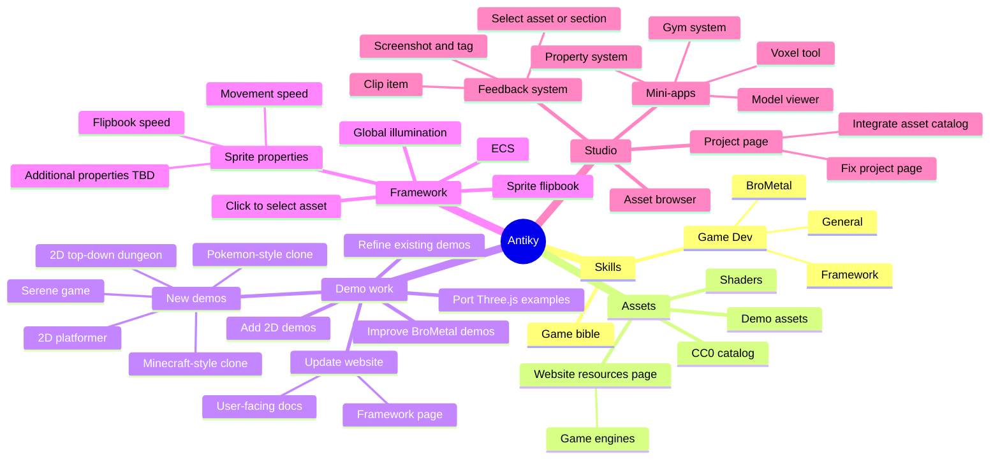

# Antiky project planning

```mermaid
mindmap
  root((Antiky))
    Skills
      Game Dev
        General
        BroMetal
        Framework
      Game bible
    Assets
      Website resources page
        Game engines
      CC0 catalog
      Demo assets
      Shaders
    Demo work
      Refine existing demos
      Update website
        Framework page
        User-facing docs
      Port Three.js examples
      Add 2D demos
      Improve BroMetal demos
      New demos
        2D platformer
        2D top-down dungeon
        Pokemon-style clone
        Minecraft-style clone
        Serene game
    Framework
      Sprite flipbook
      ECS
      Global illumination
      Click to select asset
      Sprite properties
        Flipbook speed
        Movement speed
        Additional properties TBD
    Studio
      Asset browser
      Mini-apps
        Property system
        Model viewer
        Gym system
        Voxel tool
      Project page
        Fix project page
        Integrate asset catalog
      Feedback system
        Clip item
        Screenshot and tag
        Select asset or section
```
