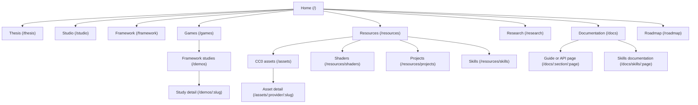

# Website launch content and delivery plan

Status: completed

Completed: 2026-08-22 UTC

Planning source: `docs/project-planning/goals/website-update/`

Public product truth: `packages/website/PRODUCT.md`

Visual authority: `packages/website/DESIGN.md`

Owner direction recorded 2026-08-21: Antiky Town is the primary public key art and first demo
action. Combat Arena remains an internal runnable project and capture source, but it must not be
listed, linked, staged, or published on visitor-facing website surfaces until the owner promotes it.
Its exact capture master remains only where required for historical ImageGen input provenance.

## Objective

Prepare `antikylabs.com` for the first coherent Antiky release. The finished site must explain the
Framework, Studio, research, games, demos, resources, and roadmap without presenting direction as
shipped capability. Every screenshot must come from the current product or a current runnable
artifact. Every technical claim must resolve to source, public documentation, a release artifact, or
a clearly written maturity label.

This plan treats the public product pages as explanations: a visitor should leave with a correct
model of what Antiky is, why it is different, what works now, and what to try next. Procedures and
complete API facts stay in user-facing documentation.

Every screenshot and product or research capture is evidence from the implementation commit. Media
created with ImageGen is illustrative marketing material: it can establish mood or carry a launch
campaign, but it cannot replace, alter, or imply current product evidence.

## Non-negotiable boundaries

- Use the labels **Current**, **Emerging**, **Direction**, and **Research question** in visible text.
  Color can reinforce a label but cannot replace it.
- Keep Framework headless and sufficient. Studio is a client of the same project services, not the
  engine and not a second source of game state.
- Describe MCP as the agent-to-engine adapter. Do not describe MCP as the architecture or confuse it
  with ACP, which carries the human-agent conversation.
- State that `@antiky/framework` and Studio are pre-release. Do not imply a stable npm package,
  cross-platform Studio release, or playable Emberwyrd build.
- Describe BroMetal accurately: its TypeScript shader DSL compiles to WGSL before the game runs;
  WebGPU still creates pipelines at runtime. Do not infer performance wins without comparative data.
- Do not claim completed agent workflows, selection, mini apps, feedback storage, sandboxes, physics,
  online play, trained models, or model-efficiency results before their public evidence exists.
- Use one evidence-bearing image or media field at a time. Avoid feature-card walls, concept art
  presented as proof, decorative terminal language, and generic AI imagery. Generated art can
  support an approved secondary marketing placement, but it cannot occupy a proof slot or depict
  invented gameplay, Studio UI, research output, or technical results.
- Use ImageGen for the launch marketing image set after the owner approves the media matrix and one
  creative direction. Keep generated images text-free by default; render product names, status,
  claims, and calls to action as accessible site or campaign typography rather than generated pixels.
- Preserve `/assets` as the canonical asset-catalog route. The Resources hub links to it; the work
  does not break existing asset URLs or create a duplicate catalog under `/resources/assets`.
- Keep the Studio release action gated by `NEXT_PUBLIC_STUDIO_RELEASES_READY`. A source build cannot
  silently become a public download claim.

## Public information architecture

```text
Home (/)
|-- Thesis (/thesis)
|-- Studio (/studio)
|-- Framework (/framework)
|-- Games (/games)
|   `-- Current technical studies (/demos and /demos/:slug)
|-- Resources (/resources)
|   |-- CC0 asset library (/assets and /assets/:provider/:slug)
|   |-- Shader library (/resources/shaders; coming soon)
|   |-- Project library (/resources/projects; coming soon)
|   `-- Skills library (/resources/skills)
|-- Research (/research)
|-- Documentation (/docs and /docs/:section/:page)
`-- Roadmap (/roadmap)
```

The ordered header navigation is **Thesis, Framework, Games, Resources, Research, Docs**. Studio is
the separate release-aware action described in `DESIGN.md`; it must not also consume a primary
navigation slot. This replaces the current top-level Assets link with Resources and keeps the
header at six destinations plus one product action. Demos and Roadmap belong in the footer,
Resources hub, and relevant page copy instead of expanding the primary navigation. The mobile
navigation must expose the same primary set plus Demos, Discord, and the release-aware Studio
action.

### Visual sitemap



### URL map

| Page | URL | Parent | Navigation | Priority |
| --- | --- | --- | --- | --- |
| Home | `/` | — | logo | High |
| Thesis | `/thesis` | Home | header | High |
| Studio | `/studio` | Home | release-aware header action | High |
| Framework | `/framework` | Home | header | High |
| Games | `/games` | Home | header | High |
| Framework studies | `/demos` | Games | footer and contextual links | High |
| Study detail | `/demos/:slug` | Framework studies | study cards and contextual links | Medium |
| Resources | `/resources` | Home | header | High |
| CC0 asset library | `/assets` | Resources | Resources hub | High |
| Asset detail | `/assets/:provider/:slug` | CC0 asset library | catalog results | Medium |
| Shader library | `/resources/shaders` | Resources | Resources hub | Medium |
| Project library | `/resources/projects` | Resources | Resources hub | Medium |
| Skills library | `/resources/skills` | Resources | Resources hub and Research | High |
| Research | `/research` | Home | header | High |
| Documentation | `/docs` | Home | header | High |
| Skills documentation | `/docs/skills/:page` | Documentation | docs navigation and Skills library | High |
| Roadmap | `/roadmap` | Home | footer, Resources, and contextual links | Medium |

### Navigation specification

- Keep six crawlable HTML links in the desktop header, in the order already named. Do not add a
  mega menu; the Resources hub carries the new library choices without increasing header load.
- Keep the release-aware Studio action separate from navigation. Its label and destination change
  only through the existing release gate.
- Give mobile the same six primary links, followed by Demos, Discord, and the same Studio
  action. Keep every row at least 48px high and preserve a visible current-page state.
- Keep the footer editorial rather than turning it into a sitemap dump. Order its links as product
  and proof (Studio, Framework, Games, Demos), open work (Resources, Research, Roadmap), then
  documentation and community destinations.
- Do not add global breadcrumbs to this shallow editorial site. Docs keeps its existing section
  navigation. Resource children include one descriptive parent link back to Resources. `/assets`
  remains a standalone canonical route, so do not display a breadcrumb that implies a false
  `/resources/assets` URL.

### Internal linking plan

| Source | Required descriptive destinations |
| --- | --- |
| Home | Framework, Studio, Games, Resources, Research, Docs, and one current study |
| Framework | Framework docs, current studies, Studio, BroMetal source, and Games |
| Studio | Studio docs, Framework, the release-aware action, and Discord |
| Games | the three study details, Demos index, Framework, and Emberwyrd direction |
| Resources | all four libraries, Roadmap, Docs, and Research |
| Skills library | skills docs, reviewed source snapshot, install commands, and Research |
| Research | completed report or repository index, active skills work, current studies, and Roadmap |
| Roadmap | Framework, Studio, Resources, Docs, and the current proving studies |

Every new route needs at least one maintained inbound link and one useful onward link. Use the action
labels in the approved copy decks as anchors; do not add “click here” or generic “learn more” links.

### Search and agent-readable contract

| Page | Primary question answered in the first paragraph | Evidence or next action |
| --- | --- | --- |
| Framework | What is an AI-native TypeScript game framework? | current Framework docs and studies |
| Studio | What does Antiky Studio do today? | current Studio guide and release-aware action |
| Research | What is an Antiky research gym? | public report, experiment source, and current studies |
| Resources | What reusable Antiky material is available now? | Assets and Skills, with honest coming-soon libraries |
| Roadmap | What is Antiky building next, without invented dates? | the editable roadmap source and linked proving work |

- Render each definition, evidence-status label, and primary action in the initial server HTML. Do
  not hide the answer behind client activation or copy written only for an AI crawler.
- Expand command-line interface (CLI), Model Context Protocol (MCP), and Agent Client Protocol (ACP)
  on first use on every page. Each page must work when retrieved without its neighboring pages.
- Make Current claims self-contained and link them to first-party docs, source, captures, releases,
  or reports. Do not add third-party statistics, testimonials, or comparison claims without a dated
  primary source and claim-ledger entry.
- Preserve the current crawl baseline in `robots.ts`, which allows ordinary crawling. Add a focused
  test that no rule accidentally blocks major search or user-triggered citation agents. Any future
  decision to block training-only crawlers is an owner policy decision, not an incidental code edit.
- Add Framework, Studio, Research, Resources, Skills, and Roadmap links with direct definitions to
  `llms.txt`. Keep `llms-full.txt` grounded in the public docs and reviewed catalog data; do not
  create separate AI-only product copy or claim the files influence Google ranking.
- Show a maintained review date where current technical facts can decay. Set it from the
  implementation claim review, not from the date this plan was written.
- Do not add FAQ or schema blocks merely to target extraction. Add a question only when it answers a
  real visitor objection that the explanation page does not already resolve.

### Positioning and copy contract

| Page | Familiar category first | Status quo or alternative | Antiky-specific value | Primary reader | Primary action |
| --- | --- | --- | --- | --- | --- |
| Framework | open-source TypeScript game framework | engines and tools make people reconstruct runtime truth for agents | people and agents inspect and change the same game through explicit interfaces | technically skeptical game builder | read current docs |
| Studio | native visual development workspace | editors, terminals, running games, and agent context are separated | keep the running game, shared state, and development activity in view together | game builder evaluating the current workspace | run or download through the release gate |
| Research | public game-technology research | showcase demos and roadmap claims omit method and limits | bounded gyms publish the question, artifact, method, result, and boundary | technically skeptical builder | inspect public evidence |

- Lead with the familiar product or research category, then explain the distinctive Antiky idea.
  Do not require the reader to understand “AI-native” before they understand what the thing is.
- Write to one reader as “you.” Put the practical benefit before the implementation mechanism and
  keep one main idea in each section.
- Give each hero one primary action and at most one secondary action. Move source, community, and
  other useful links beside the section where they answer the reader's next question.
- Place the exact first-party destination beside every technical proof claim. A generic repository
  link is acceptable only when the named report or artifact does not yet have one truthful URL.
- Keep editorial notes, unresolved alternatives, and evidence requests in the handoff deck. They
  must not appear in public page copy.

## Source ownership

| Content | Durable source | Consumer |
| --- | --- | --- |
| Framework page | `copy/framework.md` | `packages/website/src/app/framework/page.tsx` |
| Studio page | `copy/studio.md` | `packages/website/src/app/studio/page.tsx` |
| Research page | `copy/research.md` | `packages/website/src/app/research/page.tsx` |
| Roadmap | `packages/website/content/roadmap.txt` | `/roadmap` through a strict server-side parser |
| User guides | `docs/user-facing-docs/` | `/docs`, Markdown routes, search, `llms.txt` |
| Framework API reference | Framework source plus `packages/framework/scripts/api-reference-content.mjs` | generated files in `docs/user-facing-docs/api/` |
| Demo catalog | `packages/website/src/lib/demos.ts` and `packages/website/demo-publication.json` | demo index, detail pages, staged builds, sitemap |
| Skills catalog facts | a reviewed snapshot of `https://github.com/antikylabs/skills` | `/resources/skills` and `docs/user-facing-docs/skills/` |
| Evidence media | current capture masters plus `packages/website/media-publication.json` | optimized files under `packages/website/public/media/` |
| Marketing media | approved ImageGen masters and prompt sidecars plus `packages/website/media-publication.json` | optimized files under `packages/website/public/media/marketing/` and approved launch material |

Seed `packages/website/content/roadmap.txt` from `plan/roadmap.txt`; do not make a goal-directory path
a production build dependency. The public copy decks are implementation handoffs, not runtime
content files.

## Delivery sequence

### 1. Establish the claim and route baseline

1. Record the implementation commit, the current package versions, the three approved public demo
   slugs, the withheld internal Combat Arena project, and whether Studio release assets exist.
2. Build the current website in both Studio-release states and save the failing/passing baseline for
   the focused tests. Do not change `NEXT_PUBLIC_STUDIO_RELEASES_READY` merely to make copy pass.
3. Create a short claim ledger in the implementation PR description. Each changed claim names one
   of: source symbol/test, public documentation page, current screenshot, demo artifact, release
   asset, research report, or maturity label.
4. Inventory all files in `public/media` and `media-masters`. Record where each is used and whether
   it depicts current software. An unreferenced or unverified file is not approved merely because it
   looks plausible.
5. Remove manually duplicated version copy where package metadata can supply it. In particular,
   reconcile the current `BROMETAL_VERSION` site constant with the Framework dependency before any
   page names a version.

Exit evidence:

- `npm run typecheck --workspace @antiky/website`
- `npm run build --workspace @antiky/website`
- a checked route/media/claim inventory attached to the implementation work

### 2. Flatten and verify the demo package

Move the four projects from `packages/demos/antiky/<slug>` to `packages/demos/<slug>`:

- `antiky-town`
- `combat-arena`
- `point-light-expo`
- `traversal-study`

Merge the useful content in `packages/demos/antiky/README.md` into
`packages/demos/README.md`, then remove the empty `antiky/` directory. Change the root workspace glob
from `packages/demos/*/*` to `packages/demos/*` and regenerate `package-lock.json` with npm rather
than editing it by hand.

Update every executable and maintained reference in one mechanical pass, including:

- root `package.json`, `README.md`, `scripts/dev.mjs`, and `scripts/demo-capture-config.mjs`;
- `packages/website/demo-publication.json`, demo build/staging tests, and artifact source paths;
- CLI and Studio fixtures that open an example manifest;
- demo README commands, package-local tests, shared demo tests, installers, and generated-material
  inputs.

Historical planning records can keep historical paths when changing them would falsify the record.
Current guides, commands, tests, and source comments cannot. Run `rg` after the move and classify
every remaining `packages/demos/antiky` hit as historical or defective.

Audit `packages/demos/scripts/` and root demo scripts with a four-column ledger: script, caller,
output, verification. Keep a script only when at least one of these is true:

- a package/CI script invokes it;
- a maintained README documents the manual workflow and expected output;
- a test imports it and demonstrates a failure condition;
- it produces a checked artifact required by a demo build.

For a useful manual script, add a named npm command and documentation. Delete scripts with no caller,
no documented operator, and no checked output. Do not retain them as “possibly useful.”

Exit evidence:

- `npm install`
- `rg -n 'packages/demos/antiky(?:/|$)|demos/antiky(?:/|$)' package.json package-lock.json README.md scripts packages`
  has no current-path hits
- `npm run demos:verify`
- `node --test scripts/tests/*.test.mjs packages/demos/tests/build-texture-atlas.test.mjs packages/demos/tests/dev-host.test.mjs packages/demos/tests/shader/output-parity.test.mjs`
- `npm test --workspace @antiky/cli`
- `npm test --workspace @antiky/studio-app`

Commit this move separately so path churn does not hide website behavior changes.

### 3. Capture current evidence and generate launch marketing media

Before capturing or generating anything, create a route-by-route media matrix for Home, Framework,
Studio, Games, Demos, Research, Resources, and the external launch placements the owner intends to
use. For each slot, record:

- the claim or communication job the image performs;
- whether it is **Evidence capture** or **Illustrative marketing image**;
- the source application, demo, report, or approved ImageGen creative brief;
- master aspect ratio, required desktop/mobile crops, focal safe area, caption, and alt-text intent;
- the owning route or launch deliverable and the person who approves it.

Resolve the matrix against the copy decks and the `DESIGN.md` one-stage rule. One asset cannot be
classified as both evidence and illustration. Prefer a current capture whenever the communication
job is to show what Antiky does; reserve ImageGen for mood, campaign identity, and supporting
editorial material.

#### Capture coverage and freshness

Capture a fresh launch set from the implementation commit. An existing filename or visually similar
old image does not establish freshness. A prior capture may remain only when its recorded source
revision and state match the implementation baseline and the owner explicitly approves it.

The minimum public evidence set is the three approved demo posters, the four distinct Studio states
below, the current Framework hero evidence, a completed-research chart or report view, and the active
voxel-research capture. Keep the current Combat Arena capture internal for reproducibility and exact
ImageGen input provenance. Home, Games, Demos, and Framework may reuse an approved capture when it
proves the same claim; do not make near-duplicate screenshots merely to fill layout slots. Record the
exact state and fixture before capture so a later operator can reproduce it.

#### Demo captures

Use the existing managed capture boundary and deterministic fixtures in `scripts/shoot-demos.mjs`.
Extend the publication workflow so an owner-approved capture can be promoted deliberately to:

- `packages/website/media-masters/demos/<slug>.png`;
- `packages/website/public/media/demos/<slug>.webp`;
- the optional mobile master/derivative when a landscape crop would hide the subject.

Promotion must occur only after the visual-budget and control-pair checks pass. Record the demo slug,
source digest, accepted build revision, capture dimensions, capture fixture, capture date, master
digest, and delivery digest in `packages/website/media-publication.json`. Conversion is deterministic
and keeps the current minimum 2560x1440 master, WebP format, and 1.2 MB delivery ceiling.

#### Studio captures

Capture the current macOS Tauri source build at the implementation commit. Produce at least:

1. launcher with create, open, and recent-project choices;
2. full workspace with the running game, terminal, inspection, and activity visible;
3. simulation paused or stepped, with the current control state readable;
4. close inspection/activity detail showing Hierarchy, Stores or Snapshot, Events, MCP calls, and
   Diagnostics without inventing data.

Store lossless masters under `media-masters/studio/` and bounded WebP derivatives under
`public/media/studio/`. Remove local usernames, absolute paths, credentials, tokens, and unrelated
desktop content before capture by using a clean fixture project—not by painting over the final image.
Record the source commit, platform, state, dimensions, and digests in the media manifest.

#### Research and general site media

Use only current output from the research repository for research imagery. A current voxel-rendering
capture can illustrate the active gym; a chart or report page can illustrate completed shader
research. Label both by status. Do not generate research “results” as decorative artwork.

Use approved captures—not generated substitutes—for Framework proof, demo posters, Studio product
views, and any current claim elsewhere on the site. If a capture contains local UI, use a clean,
purpose-built fixture and crop; do not use ImageGen to repair, redraw, or enhance product evidence.

#### ImageGen marketing imagery and material

Use the built-in ImageGen workflow to create the illustrative launch set from the approved matrix.
The set must cover the launch key art, the share/announcement crops that will actually be published,
and any secondary editorial illustration explicitly selected for the implemented pages. Do not add
generated art to a page solely to fill empty space, and do not replace the real evidence field in the
first viewport.

Write one short creative brief before generation. It must derive its palette, restraint, composition,
and negative-space rules from `packages/website/DESIGN.md`; name the audience and placement; and say
how the image supports the Antiky thesis without depicting a fictional feature. Translate each
approved slot into an `ads-marketing` prompt with the asset type, scene, subject, framing, mood,
palette, and explicit constraints. The constraints must prohibit generated copy, logos, watermarks,
terminal decoration, fake interfaces, fake gameplay, fake charts, and unapproved brand motifs.

Generate each distinct asset or crop as its own request. If a real capture is supplied as a visual
reference, label its role and require that the result remain illustrative; do not present generated
or altered pixels as a screenshot. Review the first round together, select one direction, and iterate
with one targeted change at a time. Owner approval is required before a generated asset enters the
site or launch kit.

Store selected masters under `packages/website/media-masters/marketing/`, with a neighboring prompt
sidecar that preserves the final prompt, input-reference roles, generation method, generation date,
and approval. Publish bounded derivatives under `packages/website/public/media/marketing/`. Never
leave a project-bound generated asset only in ImageGen's default output location, and never overwrite
an approved master while exploring a revision.

Inspect every selected image at its final desktop and mobile crops. Reject output with accidental
text, invented UI, recognizable third-party marks, watermarks, misleading product affordances,
brand drift, unusable negative space, or a focal subject lost by responsive cropping. Mark the image
**Illustrative** in adjacent text when a reasonable visitor could otherwise mistake it for product,
gameplay, or research evidence.

#### Publication and cleanup

Delete superseded derivatives and masters after all references move, including retired
`town-study`, `depth-study`, old `worlds/` captures, and obsolete Studio machinery files. Keep a file
only when a live route, documentation page, Open Graph record, or explicit historical artifact owns
it. Add a test that every entry in `media-publication.json` exists, meets its dimension/size contract,
and is referenced, and that every production media reference is declared. Give each manifest entry
a source kind and public role. Capture entries require source revision and fixture/state provenance;
generated entries require the prompt sidecar, generation provenance, **Illustrative** role, and owner
approval. Tests must enforce the fields appropriate to each kind instead of applying capture-digest
rules to generated assets.

Exit evidence:

- `npm run demos:shoot -- --runs 3`
- `npm run demos:verify`
- an owner-approved media matrix, capture shot list, ImageGen creative brief, and final prompt records
- media-manifest contract tests demonstrate failure for a stale source digest, missing file, reused
  evidence image, missing generated-image provenance or approval, and oversized derivative
- desktop and mobile review of every page and launch crop that uses new media, with each asset checked
  against its Evidence or Illustrative role

### 4. Implement the content model and roadmap

Add `packages/website/content/roadmap.txt` and a small parser under
`packages/website/src/lib/roadmap.ts`. The format has exactly two nested levels: roadmap delivery and
subitem. Parse field values and item descriptions at the first colon so later colons remain content.
Ignore blank lines, but reject tabs, unknown top-level fields, duplicate fields, a subitem before its
delivery, a third nesting level, missing titles/descriptions, and empty stages. Every parser error
must include the source line number.

Render `/roadmap` on the server. It must show `title`, `intro`, and `notice` once, then each delivery
and its subitems in source order. Do not add dates, progress percentages, inferred dependencies, or
release states that are absent from the DSL. Link Roadmap from Resources and the footer; add it to the
sitemap and internal-link checks.

Add parser fixtures that prove:

- all current v0.1 through destination text parses exactly and stays in source order;
- descriptions can contain another colon;
- only two item levels are accepted;
- malformed indentation and empty values fail with stable error codes and line numbers.

### 5. Update the core explanation pages

Apply the approved copy decks to Framework, Studio, and Research. Preserve the established dark,
editorial design and its one-stage rule. Generated marketing art from phase 3 may appear only in an
approved secondary illustrative slot; it cannot replace the opening evidence field or turn this into
a visual-world replacement.

#### Framework

- Lead with the definition and changed human-only assumption from `copy/framework.md`.
- Keep current evidence near the top: a current demo capture, current session/identity/inspection
  behavior, and the first bounded point-light slice.
- Explain TypeScript, BroMetal AOT shader generation, shared clients, authority, proof, game-led
  growth, and headless use without turning the page into API reference.
- Keep the architecture diagram visibly labeled as direction and link details to current Framework,
  CLI, and MCP docs.

#### Studio

- Use the real captures from phase 3 with the supplied captions and alt text.
- Put the working launcher/workspace loop before the longer-term selection, ACP, feedback, and
  mini-app direction.
- Keep the shared-session diagram and release-aware CTA behavior.
- State that the four fixed panels are current; composable workspaces, native ACP, exact-target
  selection, and durable feedback are not.

#### Research

- Define a research gym in the first screen and distinguish a completed study, active work, and
  future questions.
- Link the completed AOT shader comparison to its reviewed public report. Fix the research-repository
  README/report filename mismatch before publishing the link, or link the repository index until it
  is fixed.
- Present skills work, the AI-native game-development pipeline, and the voxel-rendering gym as
  active. Present planned gyms and trained-model work as future questions.
- State the publication standard: method, baseline, versions/configuration, result, failures, and
  limitations.

Update Home so its quantities, product descriptions, and current/future boundaries agree with these
pages. Remove the stale “seven focused browser studies” claim unless seven approved public studies
exist at implementation time. Add contextual links to Resources and Roadmap without disrupting the
existing clarity -> conviction -> evidence -> participation sequence.

Update metadata, canonical links, visible “last reviewed” dates where they help technical freshness,
and semantic heading order. Do not add FAQ blocks merely for search extraction; add a question only
when it answers a real visitor objection not handled by the page.

### 6. Make demos poster-first and separate Games from studies

On `/demos`, replace every thumbnail `DemoStage` with a real static `next/image` poster linked to the
detail route. The index must not import a demo artifact, initialize WebGPU, autoplay, or expose an
inline Play control.

On `/demos/:slug`, render the verified poster first with a visible **Play [demo name]** button. Only
that button may load and start the interactive module. Keep the poster and a truthful static-capture
caption when WebGPU is unavailable. Preserve keyboard operation, focus, pause/resume, reduced motion,
visibility pausing, cleanup, controls, and error recovery after activation.

Use static linked posters on Games and other summary grids. The homepage may keep its single
signature live stage only if it still passes reduced-motion and mobile checks; no page may start
multiple runtimes as “previews.”

Restructure `/games` into two unambiguous bands:

1. **Playable Framework studies** — the same three approved public entries as the demo catalog, labeled as
   technical studies rather than released games.
2. **Emberwyrd** — the larger game in development, with no Play or Download action until a real
   player-facing build exists.

The Games page must derive the study count and entries from `DEMOS`; do not duplicate a partial list
or hard-code a different count. Keep Emberwyrd out of `DEMOS` and `demo-publication.json`.

Update `packages/website/tests/demo/delivery.test.mjs`, `site-shell.test.mjs`, and focused component
tests to prove that the index HTML has posters and links but no canvas or activation code, detail
HTML has one explicit Play action, and a module is not requested before that action.

### 7. Add the Resources section and skills documentation

Create:

- `packages/website/src/app/resources/page.tsx` — hub with four explicit destinations and status;
- `packages/website/src/app/resources/shaders/page.tsx` — Coming soon, with the intended content and
  no fake catalog entries;
- `packages/website/src/app/resources/projects/page.tsx` — Coming soon, with the intended content and
  no fake templates;
- `packages/website/src/app/resources/skills/page.tsx` — current skills, install/use commands, status,
  source link, and the boundary between ready and internal/stub skills.

The Skills page is a reviewed snapshot, not a client-side GitHub mirror. Source its facts from the
current `antikylabs/skills` README and leaf `SKILL.md` frontmatter at one recorded commit. Show the
repository command that lists the canonical current set:

```bash
npx skills add antikylabs/skills --list
```

Include install-one, install-several, install-all, global-install, and use-without-install examples
only when they still pass against the current CLI. List only skills marked Ready in the public table;
do not turn stubs or internal skills into public capability claims.

Add a `skills` section to `docs/user-facing-docs/` and to the allowlists in
`packages/website/src/lib/docs.ts` and `packages/website/tests/docs-site.test.mjs`. Publish at least:

- `skills/overview.md` — what an agent skill is, repository scope, compatibility boundary, and where
  the source lives;
- `skills/install.md` — task-oriented install/list/use commands, prerequisites, finish conditions,
  and safe update/removal guidance;
- `skills/reference.md` — current ready skills with purpose and supported subcommands.

Link these pages from the docs home and the Skills resource page. Because docs feed Markdown routes,
search, `llms.txt`, and `llms-full.txt`, verify all four surfaces rather than adding a website-only
description.

### 8. Audit all user and API documentation against current source

Treat “up to date” as a checked inventory, not an editorial impression.

1. **Framework API:** run the generator, inspect any changed public export, and keep descriptive
   content in `packages/framework/scripts/api-reference-content.mjs`. Never hand-edit generated API
   pages.
2. **Framework guides:** compare game modules, sessions, inspection, point lights, render driver,
   input, random, and resource disposal with package exports and tests.
3. **CLI:** compare `antiky --help`, manifest parsing, lifecycle commands, capture behavior, MCP
   transport, errors, and cleanup with `cli/development.md`, `mcp/overview.md`, and `mcp/tools.md`.
4. **Studio:** compare launcher, project switching, settings, terminal, simulation controls,
   inspection/activity views, renderer support, and release availability with the current app and
   Tauri tests. Keep future ACP/mini-app behavior out of current procedures.
5. **Assets and skills:** verify catalog totals are generated or deliberately dated, commands run,
   external URLs resolve, licenses/provenance remain explicit, and agent-readable surfaces include
   both sections.

Update `packages/cli/tests/docs/user-docs.test.ts` with behavioral assertions for every new or
changed public workflow. Avoid assertions that merely search for a heading; each new contract test
must fail when the documented command, route, boundary, or generated export is removed or changed.

Exit evidence:

- `npm run docs:api --workspace @antiky/framework`
- `npm run docs:api:check --workspace @antiky/framework`
- `npm test --workspace @antiky/framework`
- `npm test --workspace @antiky/cli`
- `npm test --workspace @antiky/website`
- `git diff --exit-code -- docs/user-facing-docs/api`

### 9. Navigation, discovery, accessibility, and final release checks

Update `src/lib/site.ts`, `SiteHeader.tsx`, `SiteFooter.tsx`, and `sitemap.ts` for Resources, Skills,
and Roadmap. Verify no new page is orphaned and every important route is within three clicks of Home.
Use descriptive anchors; never use “click here” or a bare “learn more.”

Add or update tests for:

- header/mobile/footer route parity and release-aware Studio actions;
- every new canonical URL in the sitemap;
- no broken internal links in generated production HTML;
- one H1, ordered headings, descriptive image alt text, visible status text, keyboard-operable Play,
  44px minimum mobile controls, and reduced-motion behavior;
- metadata and direct first-paragraph definitions for Framework, Studio, Research, Resources, Skills,
  and Roadmap;
- every generated production image is declared Illustrative and has prompt and approval provenance;
  the media-slot audit confirms that no Current claim uses one as evidence;
- no `town-study`, `depth-study`, stale study counts, old demo paths, concept-art proof, or unsupported
  current claims in production output.

Run a bounded visual review at 1440px desktop and 390px mobile for Home, Framework, Studio, Games,
Demos index, one demo detail, Research, Resources, each library page, Roadmap, Docs home, and one
Skills guide. Save the first-round and confirmation captures with the implementation handoff so the
updated site itself has a dated launch screenshot record. Fix the complete first-round defect list in
one batch, then run one confirmation pass. Also review every generated launch crop at its actual
delivery dimensions; a full-size master review does not approve a derived marketing asset.

Final commands:

```bash
npm run typecheck
npm test
npm run build
NEXT_PUBLIC_STUDIO_RELEASES_READY=true npm run test:release-ready --workspace @antiky/website
git diff --check
```

Do not set the production release flag until the selected GitHub release contains version, supported
platform, installation steps, release notes, limitations, and the expected downloadable assets.

## Acceptance map

| Criterion | Owned by | Completion evidence |
| --- | --- | --- |
| 1. Latest website content | phases 4, 5, 9 | [implemented surfaces](./2026-08-21-implementation-summary.md#public-information-architecture-and-copy), [launch contract](../../../../../packages/website/tests/launch-contract.test.mjs), and [visual confirmation](./visual-review.md#confirmation) |
| 2. Framework direction | phase 5 | [implementation record](./2026-08-21-implementation-summary.md#public-information-architecture-and-copy), [copy deck](../copy/framework.md), and [launch contract](../../../../../packages/website/tests/launch-contract.test.mjs) |
| 3. Studio direction and screenshots | phases 3, 5 | [media matrix](./media-matrix.md#route-and-launch-slots), [publication manifest](../../../../../packages/website/media-publication.json), and [Studio page test](../../../../../packages/website/tests/studio-page.test.mjs) |
| 4. Demo screenshots and click to play | phases 3, 6 | [shot list](./capture-shot-list.md#demo-studies), [delivery tests](../../../../../packages/website/tests/demo/delivery.test.mjs), and [activation evidence](./visual-review.md#click-to-play-check) |
| 5. Demos separate from Emberwyrd | phase 6 | [implementation record](./2026-08-21-implementation-summary.md#demo-workspaces-and-publication) and [owner-approved catalog test](../../../../../packages/website/tests/demo/delivery.test.mjs) |
| 6. Resources home | phases 7, 9 | [implementation record](./2026-08-21-implementation-summary.md#public-information-architecture-and-copy), [launch contract](../../../../../packages/website/tests/launch-contract.test.mjs), and [visual confirmation](./visual-review.md#confirmation) |
| 7. CC0 asset library | phase 7 | [Resources implementation record](./2026-08-21-implementation-summary.md#public-information-architecture-and-copy) and [site-shell route test](../../../../../packages/website/tests/site-shell.test.mjs) |
| 8. Shader library coming soon | phase 7 | [implementation record](./2026-08-21-implementation-summary.md#public-information-architecture-and-copy), [launch contract](../../../../../packages/website/tests/launch-contract.test.mjs), and [visual confirmation](./visual-review.md#confirmation) |
| 9. Project library coming soon | phase 7 | [implementation record](./2026-08-21-implementation-summary.md#public-information-architecture-and-copy), [launch contract](../../../../../packages/website/tests/launch-contract.test.mjs), and [visual defect record](./visual-review.md#first-round-findings-and-batch-fix) |
| 10. Skills library | phase 7 | [documentation record](./2026-08-21-implementation-summary.md#documentation), [docs-site test](../../../../../packages/website/tests/docs-site.test.mjs), and [visual confirmation](./visual-review.md#confirmation) |
| 11. Current user/API docs | phase 8 | [documentation and verification record](./2026-08-21-implementation-summary.md#documentation), [generated API index](../../../../user-facing-docs/api/reference.md), and [CLI docs contract](../../../../../packages/cli/tests/docs/user-docs.test.ts) |
| 12. Skills docs | phases 7, 8 | [documentation record](./2026-08-21-implementation-summary.md#documentation), [published Skills overview](../../../../user-facing-docs/skills/overview.md), and [docs-site test](../../../../../packages/website/tests/docs-site.test.mjs) |
| 13. Flattened demos and useful scripts | phase 2 | [implementation record](./2026-08-21-implementation-summary.md#demo-workspaces-and-publication), [capture behavior tests](../../../../../scripts/tests/shoot-demos.test.mjs), and commits `1a61f9b` plus `8e20c7a` |
| 14. Current real media | phases 3, 9 | [publication record](./2026-08-21-implementation-summary.md#evidence-capture-and-media-publication), [media manifest](../../../../../packages/website/media-publication.json), [publication tests](../../../../../packages/website/tests/media-publication.test.mjs), and [visual review](./visual-review.md) |
| Added launch media requirement: ImageGen marketing imagery and material | phases 3, 5, 9 | [creative brief](./imagegen-creative-brief.md), [launch kit](./launch-kit.md), [prompt/provenance summary](./2026-08-21-implementation-summary.md#imagegen-launch-set), and [delivery review](./visual-review.md#generated-delivery-review) |

## Definition of done

The implementation is complete only when every acceptance-map row has linked evidence, every
focused and full verification command passes in both Studio-release states, the visual review has no
unresolved blocker, every required fresh capture and approved marketing derivative exists, and no
production copy relies on an unlabeled future capability. A green build alone is not completion; the
media matrix, evidence and ImageGen provenance, documentation audit, demo activation behavior, and
release gate are part of the product contract.
