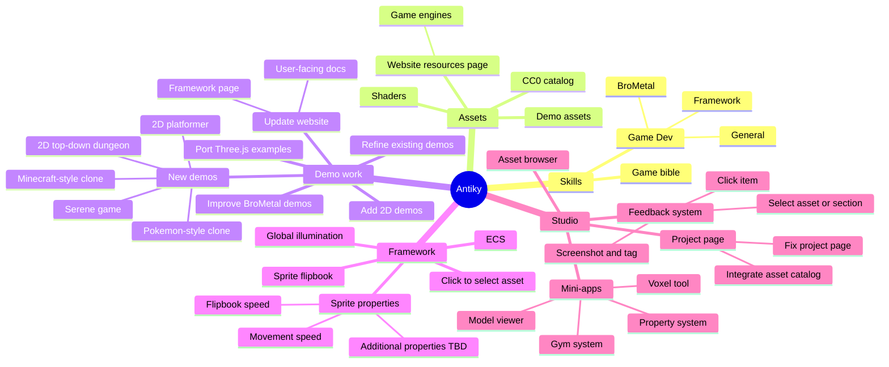

# Antiky project planning

## Glossary

- `2D platformer`: 2d side scrolling platformer in painterly style, smooth animations and actions on player, handful of oponents, nice damage hit counters, and parallax effects on background.
- `2D top-down dungeon`: 2d tinydungeon, start at entrance and go through dungeon hack and slash style. top down sprite action. open chests, lock pick doors, dodge/activate traps, fight enemies. Has fog of war/line of sight. Light source is the player's character. (a blue fairy flying around the player).
- `Add 2D demos`: Build focused 2D examples that prove Antiky works for more than 2.3D and 3D scenes.
- `Additional properties TBD`: figure out what properties to add to sprites.
- `Antiky`: The game engine and framework for creating 2D games.
- `Asset browser`: A tool for browsing and managing game assets. Within the studio.
- `Assets`: Catalog of game assets and resources for other game builders that we allow for their use.
- `BroMetal`: A typescript dsl for writing webgpu shaders.
- `CC0 catalog`: A catalog of free CC0 assets that can be used in games.
- `Click item`: Select an exact item in Studio and start feedback with its stable ID, hierarchy, revision, and other useful context attached.
- `Click to select asset`: Resolve the item under a displayed pixel to its stable Framework entity or asset so Studio can inspect it.
- `Demo assets`: Reusable art, audio, models, textures, and other resources prepared for Antiky's runnable examples.
- `Demo work`: Improve existing examples and build new ones that prove Framework, BroMetal, Studio, and renderer boundaries through working game slices.
- `ECS`: Antiky's entity and component world model: stable entities hold versioned component data, while systems contain behavior and queries find matching data. It does not require a general archetype ECS until real workloads justify one.
- `Feedback system`: Studio's contextual review queue, where comments retain an exact target and its captured context without directly changing the game.
- `Fix project page`: Bring Studio's project launcher and project-management page back in line with the design and behavior of the main and settings pages.
- `Flipbook speed`: The rate at which a sprite flipbook advances through its animation frames.
- `Framework`: Antiky's headless game layer for worlds, engine sessions, simulation, stable identities, inspection, commands, and reusable game systems.
- `Framework page`: The website page that explains what Antiky Framework does, why it exists, and how developers use it.
- `Game Dev`: Skills for game-development work, divided into general practice, BroMetal rendering, and Antiky Framework guidance.
- `Game bible`: A shared source of truth for a game's vision, world, characters, mechanics, art direction, terminology, and other durable design rules.
- `Game engines`: A website resources category for engines and frameworks that game builders can evaluate or use.
- `General`: Game-development guidance that applies independently of Antiky Framework or BroMetal.
- `Global illumination`: Lighting that includes indirect light reflected from surrounding surfaces, not only direct lights and shadows.
- `Gym system`: A proposed Studio mini-app whose exact purpose and workflow still need to be defined.
- `Improve BroMetal demos`: Raise the visual quality and usefulness of the renderer-only examples while keeping them independent of Antiky Framework.
- `Integrate asset catalog`: Connect Studio's project experience to the static Antiky asset catalog so users can discover assets and add them to a project.
- `Minecraft-style clone`: A small voxel sandbox demo focused on block-based world interaction rather than reproducing the complete original game.
- `Mini-apps`: Composable Studio tools that contribute focused panels or workspaces while preserving Studio's main game-editor experience and shared services.
- `Model viewer`: A Studio mini-app for loading, previewing, and inspecting a model and its relevant asset or rendering details.
- `Movement speed`: A sprite or character property that controls how quickly it moves through the game world.
- `New demos`: New runnable game slices that exercise planned Antiky features and present them at a useful quality bar.
- `Pokemon-style clone`: A small top-down creature-adventure demo used to prove exploration, interaction, encounters, and sprite-based game systems without copying protected content.
- `Port Three.js examples`: Find existing threejs examples and implement here so they can be opened in studio to show threejs compatibility with antiky studio and a .antiky project.
- `Project page`: Studio's entry experience for creating, opening, and returning to Antiky projects.
- `Property system`: A schema-backed way for Studio to inspect and edit entity, component, or asset properties through Framework commands.
- `Refine existing demos`: Improve the current demos' presentation, usability, code quality, and value as evidence without replacing their intended technical boundaries.
- `Screenshot and tag`: Attach a bounded visual capture to feedback and tag the exact target or context shown in it.
- `Select asset or section`: Choose an asset or a specific part of the current project or scene as the stable target for inspection or feedback.
- `Serene game`: A calm, atmosphere-first showcase demo whose exact setting and mechanics remain open.
- `Shaders`: Typed BroMetal shader programs authored in TypeScript and compiled ahead of time into WebGPU Shader Language and runtime descriptors.
- `Skills`: Reusable agent instructions for carrying out recurring Antiky, BroMetal, and game-development work consistently.
- `Sprite flipbook`: A first-class animation object that plays ordered frames from a sprite sheet over time.
- `Sprite properties`: Inspectable settings that control a sprite's appearance, animation, and movement behavior.
- `Studio`: Antiky's portable visual editor for running projects, inspecting live Framework state, issuing commands, working with coding agents, and attaching feedback to exact targets.
- `Update website`: Revise the public site so its product explanations, resources, documentation, and demos match the current repository and project direction.
- `User-facing docs`: Task-oriented documentation that helps game builders install, understand, and use Antiky's Framework, CLI, MCP, Studio, and demos.
- `Voxel tool`: A proposed GPU-native Studio mini-app for viewing or authoring voxel content; its first workflow and import, editing, and export boundaries remain undecided.
- `Website resources page`: A public directory of useful game-building resources, organized into clear categories such as game engines.
